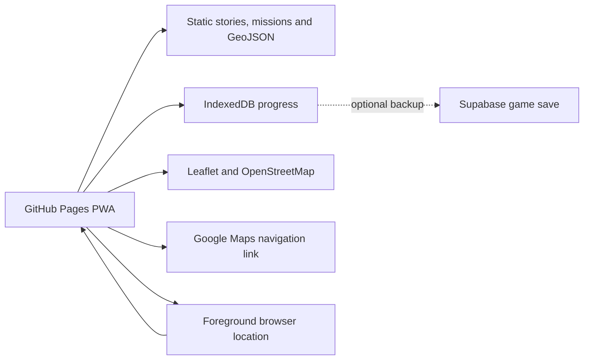

# Missione Italia — Product and Build Roadmap

**Target:** trip-ready by Saturday, 3 October 2026  
**Journey:** Basel → Gardaland area → Venice → Verona → Basel  
**App scope:** every trip day except Gardaland; Road/return content stays lightweight  
**Audience:** one family, three children aged 9, 7, and 4  
**Format:** phone-only installable web app used on one parent-controlled phone

## 1. Product definition

Missione Italia is a cooperative real-world adventure game. The journey becomes the game board; landmarks unlock short stories, observation missions, quizzes, and pieces of a shared family passport.

It is deliberately **not** an itinerary manager. Adults handle bookings and logistics elsewhere. The children see only the adventure, the next mission, and what the family has discovered.

### North-star experience

> Look up, discover something together, complete a tiny challenge, and carry the memory into the next place.

### Product principles

1. **One family, one team.** No sibling leaderboard or individual winner.
2. **Eyes on the place.** A mission uses the screen for 1–3 minutes, then sends the children back into the real world.
3. **Every age contributes.** Each mission contains a visual task, a simple reasoning task, and a harder clue.
4. **Parents remain in control.** Any mission can be skipped, unlocked, or completed manually.
5. **Offline first.** Stories, missions, rewards, and progress work without mobile data.
6. **No fragile dependencies.** The trip remains playable if maps, GPS, or Supabase are unavailable.

## 2. Story: The Lost Compass

A magical Italian compass has lost four powers. The children restore them through four lightweight chapters; Saturday closes with a short, non-required return epilogue.

| Chapter | Compass power | Experience |
|---|---|---|
| Basel → Italy | Curiosity | Countries, mountains, tunnels, road signs, and first Italian words |
| Venice | Wonder | Winged lions, canals, bridges, boats, and visual riddles |
| Murano/Burano | Creativity | Glass patterns, lagoon navigation, colorful houses, and lace clues |
| Verona | Teamwork | Roman clues, the Arena, the Adige, and the final compass ceremony |

The children rotate three roles:

- **Navigator:** follows the map and harder clues; naturally suited to age 9.
- **Detective:** solves choices, patterns, and counting tasks; naturally suited to age 7.
- **Spotter:** finds colors, shapes, sounds, and objects; naturally suited to age 4.

Roles rotate so nobody owns the “best” role. All completed tasks fill one shared compass.

### Core game loop

`Choose mission → hear the story → explore the place → solve three role clues → celebrate → collect a stamp`

## 3. UX design

### Primary flow

`Parent setup → Adventure map → Chapter → Mission → Challenge → Celebration → Passport`

### Core screens

| Screen | Purpose | Essential interactions |
|---|---|---|
| Welcome | Introduce the Lost Compass | Start adventure; continue saved trip |
| Family setup | Personalize without creating child accounts | Nicknames, age bands, avatar choice, sound setting |
| Adventure map | Show the four chapters and family progress | Open unlocked chapter; see next mission |
| Chapter | Give place context without itinerary clutter | Start next mission; open short/full walk |
| Mission card | Set expectations | Duration, distance, energy level, “Start together” |
| Story | Create meaning before the task | Read aloud; replay; continue |
| Challenge | Give every child a role | Spotter, Detective, and Navigator tasks |
| Celebration | Reward the group | Compass animation, stamp, one surprising fact |
| Passport | Preserve the trip story | Chapters, stamps, discoveries, local photos later |
| Parent Corner | Handle exceptions and logistics | Skip/unlock, GPS override, reset/delete, open navigation |

### Age-adapted interaction

| Age | Interaction style | Examples |
|---|---|---|
| 4 | Large pictures, matching, colors, sounds, pointing | “Find the lion”; choose the matching shape |
| 7 | Counting, ordering, simple multiple choice | Count arches; choose the correct boat |
| 9 | Riddles, map reading, inference, navigation | Decode a clue; identify the next waypoint |

Text should be short enough for a parent to read aloud. Spanish is the child-facing language; Italian stays as a small travel-phrase layer. Recorded Spanish narration can be added only after the essential experience is stable.

### Selected visual direction: Living Storybook Atlas

The app will look like a pocket adventure book brought to life: warm paper and passport surfaces, inked map routes, collectible travel stickers, expressive chapter illustrations, and a slightly mischievous brass compass. Functional controls stay crisp and quiet; motion appears only to reveal a clue, confirm an action, or celebrate shared progress.

The redesign uses only the approved repository set in [`planning/REDESIGN_ROADMAP.md`](planning/REDESIGN_ROADMAP.md). It borrows patterns, not finished designs: shadcn/ui supplies accessible structure, Magic UI supplies a small number of motion accents, Phosphor supplies interface icons, and verified Sketch Illustrations assets can be adapted into the story artwork. The result must remain an original Missione Italia design.

No wireframe phase is required. The UX/UI lane will define the state inventory, reusable component behavior, design tokens, original-asset brief, accessibility rules, and visual QA contract directly.

Functional icons use self-hosted Phosphor Icons under its MIT licence. The compass, chapter scenes, stamps, markers, and offline route illustrations are original or verified reusable assets with recorded provenance. The experience is mobile-first at 320–430 CSS px and expands cleanly to tablet/desktop without creating a separate desktop product.

The artistic Spanish redesign is delivered as a protected V2 track so the live local-first V1 remains the rollback build. Its workstreams, task IDs, agent order, licensing rules, and wave gates are defined in [`planning/REDESIGN_ROADMAP.md`](planning/REDESIGN_ROADMAP.md).

### Walk Mode

For Venice and Verona, the parent chooses:

- **Tired Legs:** approximately 30–45 minutes and 2–3 missions.
- **Full Explorer:** approximately 60–90 minutes and 4–5 missions.

V1 walks are curated ordered checkpoints, not automatically generated routes. The app displays the route and opens Google Maps for directions to the **next** checkpoint. This is safer, predictable, and much simpler than building a routing engine.

Murano/Burano uses ordered island checkpoints and parent-controlled transport information rather than live timetable promises.

## 4. Functional scope

### Trip-ready MVP — must work by 3 October

- Installable mobile PWA.
- Four story chapters plus a lightweight Saturday return epilogue.
- Sixteen curated missions, each with three age-role clues.
- Shared family compass and passport.
- Local setup and persistent progress.
- Adventure map with child-friendly custom markers.
- Foreground “Where are we?” location check.
- Manual check-in when GPS is weak or denied.
- Curated short/full walks for Venice and Verona.
- “Navigate” links that open Google Maps.
- Offline stories, quizzes, rewards, and progress.
- Parent Corner with skip/unlock/reset controls.
- Clear online/offline and location-permission states.
- GitHub Pages deployment and Add to Home Screen guidance.

### Add only if the MVP is already stable

- Automatic proximity unlocks.
- Read-aloud using browser speech synthesis.
- Photo missions that leave photos in the phone camera roll.
- Optional Supabase cloud backup.
- Small celebration animations and sound effects.

### Explicitly out of scope before the trip

- Dynamic route optimization.
- Background GPS tracking or location history.
- Child accounts, chat, public profiles, or public sharing.
- Competitive leaderboards.
- Push notifications.
- Live generative AI.
- Cloud photo uploads.
- General-purpose trip builder or support for other families.

## 5. Initial mission inventory

| Chapter | Suggested missions |
|---|---|
| Road | Country Detective; Alpine Tunnel Hunt; First Italian Words |
| Venice | Find the Winged Lion; Bridge Detective; Venice Boat Detective; Canal Sound Hunt |
| Murano/Burano | Glass Pattern Lab; Lagoon Navigator; Colour-and-Lace Code |
| Verona | Arena Time Machine; Juliet's Message Mystery; Cross the Adige; Rebuild the Compass |

### Confirmed calendar

| Date | Confirmed plan | Overnight | App scope |
|---|---|---|---|
| Sun 4 Oct | Basel → Gardaland area | Gardaland area | Lightweight Road chapter |
| Mon 5 Oct | Gardaland; transfer afterward | Venice | Excluded |
| Tue 6 Oct | Venice city | Venice | Venice chapter |
| Wed 7 Oct | Murano and Burano; transfer afterward | Verona | Lagoon Islands chapter |
| Thu 8 Oct | Arena, Juliet's House, Verona; optional short excursion TBC | Verona | Verona city missions |
| Fri 9 Oct | Full-day car excursion TBC | Verona | Selected destination pack |
| Sat 10 Oct | Return to Basel | Home | Lightweight return epilogue |

See `planning/TRIP_CALENDAR.md` for the authoritative content boundary.

### Verona-base recommendation

The dates are confirmed; the two excursion choices remain open.

| Date | Morning | Afternoon | Poor-weather fallback |
|---|---|---|---|
| Thu 8 — Verona | Arena and compact historic-centre treasure hunt | Recommended: remain in Verona for Ponte Pietra, funicular, Castel San Pietro viewpoint, and Adige clue | Castelvecchio or Natural History Museum; prebooked Children's Museum session |
| Fri 9 — recommended trip | Parco Giardino Sigurtà nature and maze missions | Slow Borghetto mill-and-river mystery | Cancel the outdoor day and use the Verona indoor pair |

This gives Verona a real full day and keeps Friday in one nearby cluster. Sirmione plus a short Lazise stop remains the higher-friction lake/castle alternative. Each block includes a lunch/reset buffer and tired-legs variant; live hours, parking, transport, weather, and closures must be rechecked immediately before use.

Final wording and factual claims must be checked before publishing. Missions should never reward running, unsafe road crossing, screen use while walking, or going on a ride a child does not want to take.

## 6. Free and simple technical architecture

### Chosen stack

| Layer | Choice | Why |
|---|---|---|
| Front end | React + TypeScript + Vite | Familiar, small, and easy to deploy |
| App format | PWA with `vite-plugin-pwa` | Installable and offline-capable |
| Hosting | GitHub Pages + GitHub Actions | Free static hosting; workflow is packaged for manual personal-repository import |
| In-app map | Leaflet + OpenStreetMap | No Google Maps billing dependency |
| Navigation | Google Maps URLs | Opens walking/driving directions without an API key |
| Location | Browser Geolocation API | Free foreground location on HTTPS |
| Local data | IndexedDB | Durable offline progress and settings |
| Cloud data | Supabase, optional | Parent-owned backup after core gameplay works |
| Content | Versioned JSON and GeoJSON | Fast, testable, offline, and easy to edit |

Do not use the Google Maps JavaScript or Routes APIs for V1. They require a billing-enabled project even where monthly free usage may cover a small family app. Keyless [Google Maps URLs](https://developers.google.com/maps/documentation/urls/get-started) provide the handoff we actually need.

### Architecture



### Repository shape

```text
missione-italia/
  src/
    components/
    features/
    lib/
    styles/
  public/
    content/
      trip.json
      places.geojson
      missions/
      walks/
      rewards.json
    assets/
      images/
      audio/
  supabase/
    migrations/
  ROADMAP.md
```

Use one page with internal view state rather than a complex router. If routing is introduced, it must be compatible with the GitHub Pages subpath and refresh behavior.

### Account and deployment boundary

Codex builds and validates a portable local source package. It does not use the connected professional GitHub identity, connect to the personal GitHub account, push a remote, enable Pages, or change the remote Supabase project. The package includes `MANUAL_IMPORT.md`, GitHub Actions, `.env.example`, SQL migrations, and RLS policies so the user can perform those account-level steps manually.

## 7. Maps and offline behavior

### In-app map

- Leaflet renders the route, chapters, checkpoints, and the current foreground location.
- OpenStreetMap attribution remains visible.
- `places.geojson` contains fixed coordinates and unlock radii.
- `walks/*.geojson` contains curated ordered checkpoints and display lines.
- GPS is requested only after the parent taps “Where are we?” or starts a nearby mission.
- The app never stores a breadcrumb trail or location history.

OpenStreetMap’s public tile service is best-effort and does not allow bulk/offline tile downloading. The service worker therefore caches the **game**, not map tiles. Offline map fallback is a simple chapter route illustration plus the ordered checkpoint list. See the official [OpenStreetMap tile policy](https://operations.osmfoundation.org/policies/tiles/).

### Navigation

“Walk there” and “Drive there” open a [Google Maps URL](https://developers.google.com/maps/documentation/urls/get-started) for the next checkpoint. Google Maps is not embedded and no Google API key is stored.

## 8. Data and backend

### Static in GitHub Pages

- Story chapters and facts.
- Mission instructions, age variants, answers, and rewards.
- Landmark coordinates and unlock radii.
- Curated walks.
- Illustrations, icons, and essential audio.

This content is public because GitHub Pages is public on GitHub Free. It must contain no family details, private photos, credentials, or secret keys. Quiz answers being readable in the bundle is acceptable for a private family game.

### Local on the device

- Nicknames and age bands.
- Current chapter.
- Completed missions.
- Earned compass powers and stamps.
- Parent settings.
- Pending optional cloud save.

### Supabase — optional cloud backup

V1 can run with no backend dependency. Once the local game loop is stable, add one parent Magic Link account and one save table:

```text
game_saves
  id uuid primary key
  owner_id uuid not null
  trip_key text not null
  content_version text not null
  state jsonb not null
  revision integer not null default 1
  updated_at timestamptz not null
  unique(owner_id, trip_key)
```

The browser writes locally first, then backs up the full save when online. Revision conflicts never overwrite silently; the parent chooses the device or cloud snapshot. Field-level merging is deferred.

Security rules:

- Enable Row Level Security.
- Only authenticated parents can read or write their own row where `owner_id = auth.uid()`.
- Use both read/update ownership checks and insert/update validation.
- Expose only the browser-safe Supabase publishable key.
- Never expose a secret or service-role key.
- The user supplies only the Project URL and browser-safe publishable key through local/personal-repository configuration; neither is pasted into chat.
- Store nicknames and age bands, not full names, birth dates, or location history.
- Provide “Delete trip data.”

Supabase Free is ample for this family-scale use, but inactive free projects can pause. Local-first operation ensures this cannot break the trip. See [Supabase billing and quotas](https://supabase.com/docs/guides/platform/billing-on-supabase), [free-project pausing](https://supabase.com/docs/guides/platform/free-project-pausing), [API key guidance](https://supabase.com/docs/guides/getting-started/api-keys), and [RLS guidance](https://supabase.com/docs/guides/database/postgres/row-level-security).

## 9. Privacy and safety

- One parent-controlled session; no child authentication.
- Use nicknames or role names only.
- Location exists only in memory while the app is open.
- No ads, analytics, trackers, or social integrations.
- Photos stay in the family phone’s camera roll for V1.
- Parent can complete a mission manually if GPS, accessibility, weather, or energy makes the original task unsuitable.
- Provide a single action to erase local and optional cloud progress.
- Place all parent settings behind a deliberate press-and-hold interaction, not a pretend security PIN.

## 10. Delivery roadmap

The dated plan below records the original trip-ready V1 delivery. The approved Spanish/artistic V2 work continues through the gated redesign waves in [`planning/REDESIGN_ROADMAP.md`](planning/REDESIGN_ROADMAP.md); it may not destabilize the live V1.

### 29 September — product lock

- Approve this roadmap.
- Lock the Lost Compass story and shared-team model.
- Define the content schema.
- Draft the 16 scored missions plus the lightweight Saturday epilogue.
- Produce the complete task plan and screen-state contract without a wireframe phase.

**Gate:** every screen and mission state is defined before implementation.

### 30 September — visual direction and foundation

- Lock the Living Storybook Atlas art-direction brief.
- Finalize typography, color, illustration, icons, component behavior, and motion rules.
- Scaffold the Vite PWA only after a visual direction is chosen.
- Package the GitHub Pages workflow, configurable repository base path, and manual-import guide.
- Implement app shell, local save, and offline cache.

**Gate:** the app installs, reloads, and opens offline.

### 1 October — playable core

- Build onboarding, chapter map, mission engine, challenge variants, celebration, and passport.
- Add every manifest-enabled chapter and one complete mission in each.
- Verify local progress survives refresh and device restart.

**Gate:** the family can complete the full story loop without maps or Supabase.

### 2 October — places and content

- Add all missions and fact-check place content.
- Add Leaflet, chapter markers, foreground location, and manual check-in.
- Add curated Venice and Verona walk packs.
- Add Google Maps navigation handoff.
- Test denied location, weak network, and offline states.

**Gate:** every mission is playable through both the normal and fallback paths.

### 3 October — field test and freeze

- Test on the actual family phones.
- Walk a short outdoor route with location allowed and denied.
- Test Add to Home Screen and airplane mode.
- Let each child complete one mission without coaching beyond normal reading help.
- Remove or simplify anything confusing.
- Deploy the frozen trip version and keep a rollback build.

**Gate:** no new features after the field test; only blocking fixes.

### 4 October — travel

- Use the frozen local-first build.
- Record observations for a post-trip version; do not modify production during the journey unless blocked.

## 11. Definition of trip-ready

The MVP is ready only when:

- It opens from the home screen on the actual family phone.
- A first online visit is followed by a successful airplane-mode restart.
- A mission can be completed and remains completed after reload.
- Every manifest-enabled chapter can be reached without GPS.
- Location allowed, denied, inaccurate, and unavailable states are understandable.
- Navigation links open the intended destination.
- The parent can skip or manually unlock every mission.
- No child data, precise location, secret, or private photo is published.
- The youngest child has meaningful input in every mission.
- No essential trip interaction depends on Supabase or live map tiles.

## 12. Post-trip roadmap

Only after the family has used V1:

1. Add optional parent cloud backup and recovery.
2. Add private, compressed photo storage with metadata removal.
3. Generate a family adventure recap.
4. Normalize progress only if multi-device use proves necessary.
5. Extract a reusable trip authoring format for future destinations.

## 13. Key decisions

| Decision | Chosen | Rejected for V1 |
|---|---|---|
| Game model | Cooperative family quest | Individual scores and leaderboard |
| Device model | One parent-controlled phone | Three child accounts/devices |
| Route model | Curated checkpoint walks | Live route generation |
| Map | Leaflet + OpenStreetMap | Billing-enabled Google Maps SDK |
| Navigation | Google Maps URL handoff | Embedded turn-by-turn navigation |
| Progress | IndexedDB first | Backend-required gameplay |
| Backend | Optional one-row Supabase save | Complex normalized platform |
| Photos | Phone camera roll | Cloud upload before the trip |

## 14. Next execution artifact

Use the master task board and specialist lane backlogs under `planning/`. No implementation blocker remains; execute one specialist agent at a time and pass approved artifacts to the next lane.
