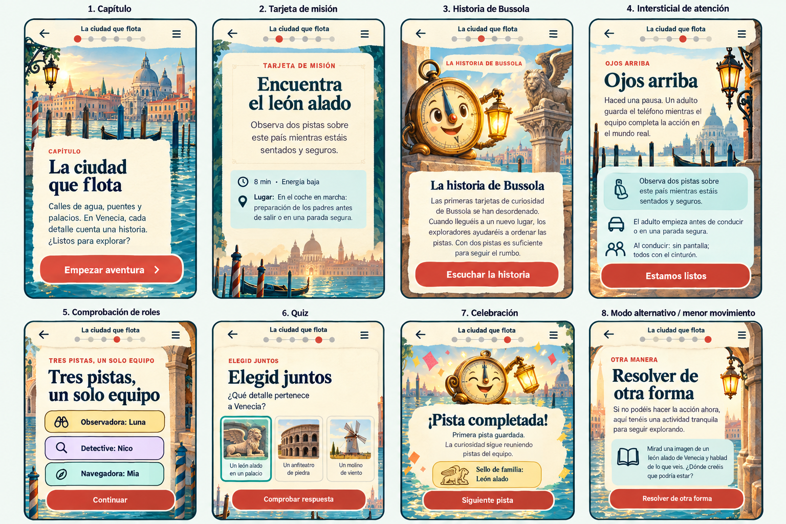
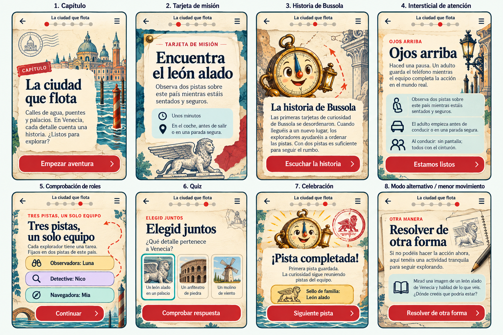
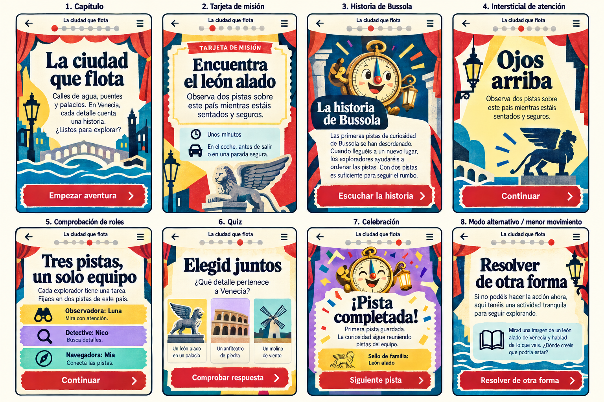

# R0 UX art treatments

All treatments use the same Story-approved `VEN-01` eight-beat flow: chapter, mission card, story, eyes-up, role check-in, quiz, celebration and fallback/reduced motion. They do not change IDs, facts, scoring, completion, save behavior or safety language.

The boards are visual direction artifacts, not shippable UI or final artwork. Image-rendered microcopy may differ from the locked Spanish source; implementation must use `R0_SPANISH_SAMPLE_FLOW.md` verbatim. No third-party asset was imported into these boards.

## Treatment 1 — Lagoon Lantern

**Intent:** turn Venice into a luminous illustrated chapter while keeping reading surfaces calm.

| System area | Direction |
|---|---|
| Tokens | `paper #FFF8E7`, `ink #14212B`, `lagoon #06747A`, `deep-water #0B3340`, `tomato #DC4B38`, `sun #F2B84B`, `mist #D7F3EF`; 4 px spacing grid; 16 px phone inset; 20/28 px child body/line. |
| Type | System Georgia bold for story headings; existing Atkinson Hyperlegible Next for reading and controls. Maximum two families. |
| Illustration | Layered watercolor-like chapter scenes exported as responsive WebP, with a small set of crisp SVG overlays. Bussola appears only in Story and Celebration. |
| Components | Scenic chapter hero → solid mission parchment → captioned story plate → stripped-back eyes-up → colored role rows → three illustrated answer tiles → finite reflection/stamp scene. |
| Icons | Phosphor Duotone, regular weight, 24–28 px; no Lucide mixing unless a semantic gap is documented. |
| Motion | One ripple reveal, one wing unfold, one lantern glow and one reflection/stamp settle. Only transform/opacity; maximum two moving elements. |
| Reduced motion | Final illustration, label, stamp and progress state appear immediately; no ripple travel, glow cycle, wing unfold or parallax. |

**Trade-offs:** strongest sense of place and youngest-child appeal; heaviest chapter-art production and decode cost. Scenic art can compete with copy and crop poorly across widths. Budget assumption for planning: roughly 250–400 KB optimized art per chapter plus a shared Bussola cutout.

## Treatment 2 — Fold-Out Field Guide

**Intent:** make the phone feel like a family explorer’s notebook assembled during the trip.

| System area | Direction |
|---|---|
| Tokens | `paper #FFF7E4`, `paper-raised #FFFDF6`, `ink #123049`, `teal #0B6A6E`, `vermillion #D73A2F`, `brass #C88918`, `graphite #6B6256`; 4 px grid; 16 px inset; 18/27 px child body/line. |
| Type | System Georgia bold for chapter/story display; existing Atkinson Hyperlegible Next for all actionable and long-form text. |
| Illustration | Original ink vignettes, cut-paper shapes, stamps and sparse place motifs. Prefer optimized SVG; use WebP only for bounded texture. Texture never sits behind essential text. |
| Components | Stamped chapter tab → pinned mission sheet → illustrated story folio → single safety card → equal role tickets → specimen-style quiz tiles → earned passport stamp → alternate activity folio. |
| Icons | Phosphor Regular/Duotone at 24–28 px with dark ink outlines. One icon weight per component family. |
| Motion | Paper flap opens once, dotted route draws once after a user action, and the family stamp lands once. No idle movement. |
| Reduced motion | Flap, route and stamp travel are removed; the opened/final state crossfades in ≤100 ms with the same labels and focus. |

**Trade-offs:** clearest continuity with the existing Living Storybook Atlas and easiest long-form reading. Moderate asset work and good SVG reuse. The risk is a generic scrapbook or faux-antique look; paper distress must stay outside text and travel clichés must be avoided. Budget assumption: roughly 120–220 KB optimized art per chapter plus shared line-art assets.

## Treatment 3 — Stamp Theatre

**Intent:** stage each mission as one bold, shared family scene with a distinct curtain-call reward.

| System area | Direction |
|---|---|
| Tokens | `cream #FFF7DF`, `ink #062C45`, `stage-red #E7342C`, `teal #007D8B`, `violet #8460C3`, `sun #F7C84B`, `white #FFFFFF`; 4 px grid; 16 px inset; 18/26 px child body/line. |
| Type | Existing Fredoka 700 for short display headings; existing Atkinson Hyperlegible Next 400/700 for reading, labels and buttons. |
| Illustration | Original flat cut-paper/screen-print SVG scenes with uneven ink edges: wing, bridge arch, ripple, lamp and Bussola. No full scenic background. |
| Components | Stage-title chapter → ticket mission panel → narrator spotlight → minimal eyes-up spotlight → three role tickets → three tactile quiz panels → one curtain-call stamp → equally polished quiet alternate scene. |
| Icons | Phosphor Duotone/Bold, 26–30 px, consistently dark ink; icon + label + shape always carries meaning. |
| Motion | One curtain wipe per forward beat, active-role spotlight snap, ticket perforation confirmation and finite confetti/stamp at celebration. |
| Reduced motion | The next stage replaces the previous one instantly or with a ≤100 ms opacity change; spotlight, curtain, perforation and confetti are removed. |

**Trade-offs:** most original and memorable, strongest scan hierarchy and lightest asset pipeline because flat SVG art can be recolored and reused. It needs disciplined color-area limits to avoid a circus feel, and large headings must reflow gracefully in English and at 200% zoom. Budget assumption: roughly 60–140 KB optimized art per chapter plus shared vector motifs.

## Recommendation

**Selected by the user on 30 September 2026: Treatment 3 — Stamp Theatre**, using the existing V1 interaction contract as its invisible skeleton.

- **Accessibility:** bold hierarchy, solid cream reading surfaces, persistent labels and large role/answer targets work well for shared outdoor viewing. Guardrail: saturated panels are accents, never long-form text surfaces; verify every pair and 200% reflow.
- **Performance:** flat SVG motifs, a shared Bussola asset and transform/opacity-only choreography create the best chance of meeting the current shell +100 KB and 60 fps targets. Confetti is finite and optional.
- **Originality:** the family is completing a travelling paper theatre rather than using a generic travel app or copied template. The visual metaphor supports story, roles, quiz and stamp without adding a second mascot.
- **Asset production:** one modular motif kit can serve every chapter. This reduces illustration volume, but the kit must be art-directed tightly so destination silhouettes remain distinctive rather than decorative.

The art-direction decision is closed. R0 closes after the representative Spanish sample is approved; future reusable assets still pass the provenance gate before import.
